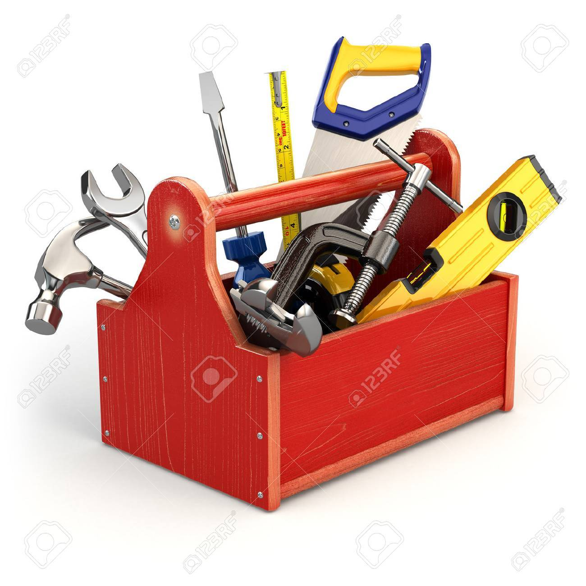

<!-- .slide: id="lesson14" -->

# Basic Frontend - Fall 2019

Lesson 14, Thursday, 2019-10-17

---

### Recap: What's in our Toolbox?

 <!-- .element height="400px" width="400px" -->

---

### Recap: What's in our Toolbox?

* Variables, Types, Operators
* `if`, `else if`, `else`
* `function`
* `while`
* `for`
* Array
* DOM

---

### Recap: What's in our Toolbox?

* Variables, Types, Operators - *store and manipulate our data*
* `if`, `else if`, `else` - *conditional logic*
* `function` - *organizing, grouping code*
* `while` - *generic loop*
* `for` - *loop, counting up/down*
* Array - *contains multiple values*
* Objects - *contains key/value pairs*
* DOM - *represents all elements in HTML*

---

### Recap - objects

What are different types of objects that we've seen so far?

---

### Recap - objects

What are different types of objects that we've seen so far?

* Any objects created with `{}`
* All Arrays
* `console`
* `document`
* DOM elements (e.g. input elements, div elements...)

---

### Recap - DOM

Create a new html `div` element, and add it to the body

---

### Recap - DOM

Create a new html `div` element, and add it to the body

```js
let newElement = document.createElement("div");
newElement.textContent = "Hello World!";
document.body.appendChild(newElement);
```

Remember - use `appendChild` to add your element to another element.

---

### Recap - DOM

```html
<body>
   <input type="text" id="shopInput" />
   <ul id="shoppingList"></ul>
</body>
```

What JavaScript code do you need to write to access the `input` and the `ul` elements?

---

### Recap - DOM

```html
<body>
   <input type="text" id="shopInput" />
   <ul id="shoppingList"></ul>
</body>
```

What JavaScript code do you need to write to access the `input` and the `ul` elements?

```js
let shopInputElement = document.getElementById("shopInput");
let shoppingListElement = document.getElementById("shoppingList");
```

---

### Recap - DOM

```html
<input type="text" placeholder="Your name">
```

Can you create the element above from JavaScript?

---

### Recap - DOM

```html
<input type="text" placeholder="Your name">
```

Can you create the element above from JavaScript?

```js
let inputElement = document.createElement("input");
inputElement.type = "text";
inputElement.placeholder = "Your name";
document.body.appendChild(inputElement);
```

---

### Recap - DOM

```html
<button onclick="console.log(‘submit pressed’)">Submit</button>
```

Create this in JavaScript.

---

### Recap - DOM

```html
<button onclick="console.log(‘submit pressed’)">Submit</button>
```

Create this in JavaScript.

```js
let submitButtonElement = document.createElement("button");
submitButtonElement.textContent = "Submit";
submitButtonElement.onclick = function() {
    console.log("submit pressed");
}

document.body.appendChild(submitButtonElement);
```

---

### Recap - DOM

```html
<ul>
   <li>Bread</li>
   <li>Butter</li>
   <li>Cheese</li>
 </ul>
```

Create this in JavaScript

---

### Recap - DOM

```html
<ul>
   <li>Bread</li>
   <li>Butter</li>
   <li>Cheese</li>
 </ul>
```

```js
let items = ["Bread", "Butter", "Cheese"];
let listElement = document.createElement("ul");
for (let item of items) {
   let liElement = document.createElement("li");
   liElement.textContent = item;
   liElement.appendChild(itemElement);
}
document.body.appendChild(listElement);
```

---

### last Homework
let us finish the homework from last time.

---

### more?

* Add a button to each recipe, when you click on it, it will hide or reveal the contents of the recipe.
* When hovering over the title of the recipe, change the color of the text
* Strike a line through one of the ingredients if the user clicks on it

---

### solutions

[See the code on github](https://github.com/ReDI-School/js-berlin-2019-fall/tree/master/14_recipes)

---

### even more?

* make the font of the name of the recipe bigger when the user hovers over it.
* modify your recipes array, add a new property to each recipe which contains the url of an image of that recipe, use this url to create and add an `img` element to your recipe.
* make sure the new image is also hidden when the user clicks on the hide button
* make the image bigger when the user clicks on it
