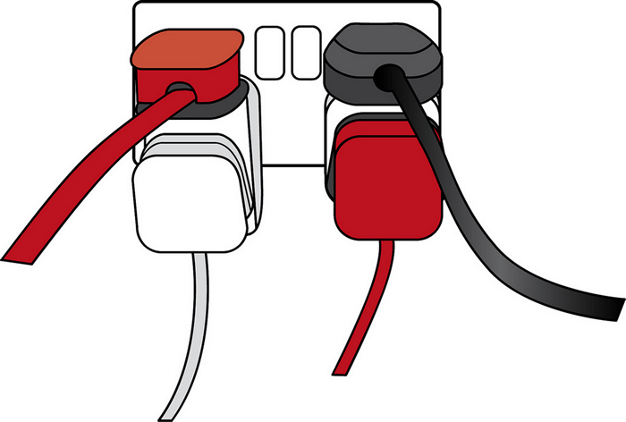

<!-- .slide: id="lesson15" -->

# Basic Frontend - Fall 2019

Lesson 15, Tuesday, 2019-10-22

---

### Dynamic Web Pages

* Up until now, we created web pages based on some "static" data
* How would we create a web page with "dynamic" data, e.g. today's weather?

---

### Basic building blocks

We need to first learn about a few concepts:

1. JSON - How to exchange data
1. API / REST API - How to talk with a server
1. `fetch` - How to connect to a server

---

### JSON

* JSON stands for **J**ava**S**cript **O**bject **N**otation
* It is a string representation of a JavaScript object
* All *keys* in our key value pairs must be in quotes
* Must contain only these types:
   * string, number, boolean, array
   * null
   * another JSON object
* These types are **forbidden**:
   * function, undefined

---

### JSON example

```json
{
    "name": "Bob",
    "instructor": true,
    "hobbies": [ "eat", "sleep" ],
    "age": 86,
    "workAddress": {
        "street": "Invalidenstraße",
        "number": 116,
        "city": "Berlin"
    }
}
```

---

### object <-> JSON

JavaScript offers us a convenient way to convert between an object and JSON and vice versa:

```js
let obj = {
    name: "Bob",
    instructor: true
};

// turn our object to JSON:
let json = JSON.stringify(obj);

// turn our JSON back to an object:
let jsonAsObj = JSON.parse(json);
```

---

### Why JSON?

* When we exchange data between a browser and a server, the data can only be text
* JSON is text
* JSON can be easily transferred (and stored)
* The notation is very close to JavaScript objects, easy to handle from JavaScript. No complex parsing required.
* More info: https://developer.mozilla.org/en-US/docs/Learn/JavaScript/Objects/JSON

---

### Quiz

* What does the following output?

```js
typeof JSON.stringify({ name: "Bob" });
typeof JSON.parse('{"city":"Berlin"}');
```

---

### Quiz - answer

```js
typeof JSON.stringify({ name: "Bob" }); // "string"
typeof JSON.parse('{"city":"Berlin"}'); // "object"
```

---

### API

* API stands for **A**pplication **P**rogramming **I**nterface
* It is the *contract* between your application and the server

 <!-- .element height="400px" width="400px" -->

---

### REST API

* REST stands for **R**epresentational **S**tate **T**ransfer
* REST APIs work via http(s), the same protocol we use to connect to any website
* Example for a REST API call: https://restcountries.eu/rest/v2/lang/de
* More info: https://developer.mozilla.org/en-US/docs/Glossary/REST

---

### What is missing?

* Now we know how to **talk** to a server: REST API
* Now we know how to **exchange** data with a server: JSON
* But how do we **connect** to the server from within JavaScript?

---

### XMLHttpRequest

```js
let url = 'https://something.com/';

function load(url, callback) {
 let xhr = new XMLHttpRequest();

 xhr.onreadystatechange = function() {
   if (xhr.readyState === 4) {
     callback(xhr.response);
   }
 }

 xhr.open('GET', url, true);
 xhr.send(null);
}
```

---

### fetch - Promises

```js
fetch("http://something.com").then(function(response) {
    return response.json();
  }).then(function(json) {
    console.log("got json: " + json);
  });
```

---

### fetch - async/await

```js
async function fetchMyApi() {
  let response = await fetch("http://something.com");
  let result = await response.json();
  console.log(result);
}
```

---

### async/await

* Fetching data from the internet might take a lot of time
* We must not block our browser while waiting for the reply!
* `XMLHttpRequest` was working with callbacks. The API is ugly, error-prone and difficult to use
* `fetch` with promises is a bit better, but still complex to use
* `fetch` with `await/async` is the cleanest, easiest

---

### async/await

* JavaScript introduced two new keywords: `async` and `await`
* We can use the `await` keyword only in `async` functions!
* `await` executes the call, continues executing the code which is after the `async` function
* once the result of the `await` is available, the code in the `async` function resumes
* This allows us to execute long-running functions without blocking the browser

---

### Full fetch example

```js
async function fetchMyApi() {
  // connects to something.com
  let response = await fetch("http://something.com");
  // "downloads" the resource, converts the JSON for us.
  // We don't need to call JSON.parse()!
  let result = await response.json();
  console.log(result);
}

fetchMyApi();
```

---

### Let's play!

* Go to https://restcountries.eu/
* Check their API, try searching for a country by name, e.g.: https://restcountries.eu/rest/v2/name/united
* Check the returned JSON - what fields does it have? What is an array, what is an object?
* Download that URL from inside JavaScript, using `fetch`.
* Create a few HTML elements describing the country (name, language, population, ...)

---

### Let's play

* BONUS: Can you add a “search” input element and a “search” button element that when clicked searches for countries of that name?
* BONUS: Can you also show the flag as a HTML image element?
