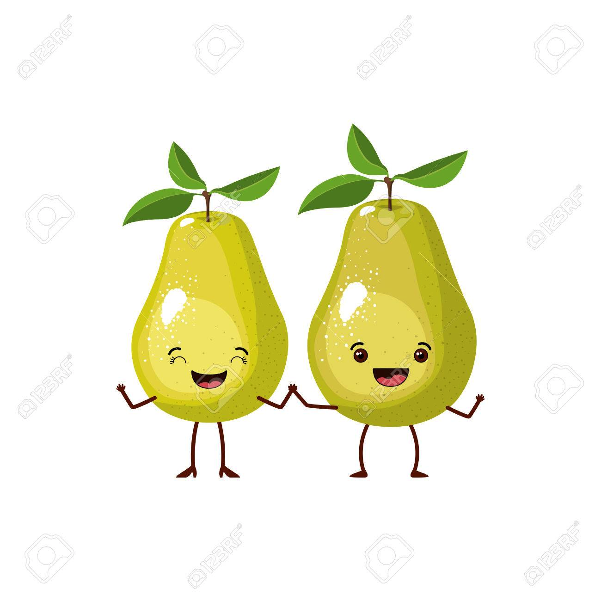

<!-- .slide: id="lesson8" -->

# Basic Frontend - Fall 2019

Lesson 8, Tuesday, 2019-17-12

---

### Preject: Guessing game

Already done?

* **BONUS**: Output all the wrong guesses as well
* **BONUS**: After the user wins a game, choose a new secret number and let the user play again

---

### Quiz - Question 1

* How can we include a JavaScript file in our HTML file?

---

### Quiz - Question 1

* How can we include a JavaScript file in our HTML file?

```html
  <script src="main.js"></script>
```

---

### Quiz - Question 2

* How can we get an element from our document by its `id` attribute?

---

### Quiz - Question 2

* How can we get an element from our document by its `id` attribute?

```js
  let myElement = document.getElementById("someId");
```

---

### Quiz - Question 3

* How can we get the value from a html `<input>` field?

---

### Quiz - Question 3

* How can we get the value from a html `<input>` field?

```js
let myValue = myInputElement.value;
```

---

### Quiz - Question 4

* How can we set the text in an html element?

---

### Quiz - Question 4

* How can we set the text in an html element?

```js
myElement.textContent = "Hello";
```

---

### Quiz - Question 5

* How do we execute JavaScript when a button is clicked?

---

### Quiz - Question 5

* How do we execute JavaScript when a button is clicked?

```html
<button onclick="myFunction()">Click me!</button>
```

---

### Variable lifetime

Variables live only in their scope (the block of code surrounded by curly braces):

```js
function foo()
{
  let x = 42;
  // x is available
}

// x is NOT available
```

---

### Variable lifetime (2)

```js
function foo()
{
  let x = 42;
  // x is available
  if (x >= 42) {
    let y = 7331;
    // y and x are available
  }
  // only x is available, y is NOT available
}

// x and y are NOT available
```

---

### Global scope

Variables declared _outside_ a code block are in the global scope and are globally available:

```js
let buttonClickCount = 0;

function onButtonClick() {
  buttonClickCount += 1;
  console.log("you clicked the button " + buttonClickCount + " times");
}
```

---

### Objects

* Objects are a collection of *properties*
* A property is a pair of a *key* and a *value*.
* Every piece of data is stored in the object with a key (like a variable name).
* Keys unlock what is behind the door.
* The type of key is string.
* The value is the content accessed by the key. What is behind the door!
* The type of the value can be any type.

---

### Remember: Pairs

 <!-- .element height="600px" width="600px" style="display: block; margin: 0 auto" -->

---

### Example

```js
let person = {
  firstName: 'John',  // key: firstName - value: 'John'
  lastName: 'Doe'     // key: lastName  - value: 'Doe'
};
```

* Objects start and end with curly braces `{}`
* They can contain zero or more key-value pairs

---

### Accessing key-value pairs

* You can access the values of an object with a dot: `.`

```js
let person = {
  firstName: 'John',
  lastName: 'Doe'
};

console.log(person.firstName); // prints "John"
console.log(person.lastName); // prints "Doe"
```

---

### Try it out!

* Write some facts about you and print them to console:

```js
let person = {
  firstName: 'Bob',
  age: 32,
  isStudent: true
};

console.log("Hi, I am " + person.firstName + " and ...");
```
